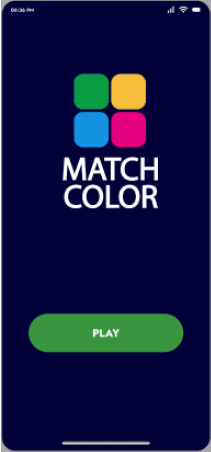
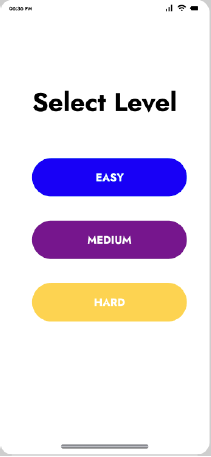
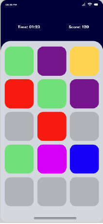
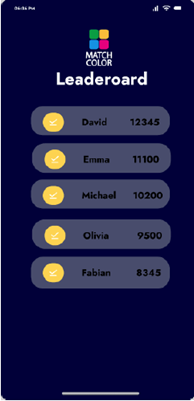

# 🎨 Color Match

**Color Match** es un juego móvil casual diseñado para desafiar la rapidez visual, la memoria y la precisión del jugador a través de niveles progresivos con una mecánica simple y entretenida: ¡combinar los colores correctos antes de que se agote el tiempo!

---

## 📱 Capturas de pantalla

| Pantalla de Inicio | Selección de Niveles | Juego en Curso | Calificación |
|--------------------|----------------------|----------------|----------------|
|  |  |  | |

---

## 🎯 Características principales

- 🔓 Desbloqueo progresivo de niveles: Easy, Medium y Hard.
- 🎯 Mecánica simple: selecciona tarjetas del mismo color.
- ⏱️ Juego contra reloj para poner a prueba tu concentración.
- 🌈 Paleta de colores vibrantes y animaciones suaves.
- 🧠 Mejora tu memoria y percepción visual.
- 🔁 Rejugabilidad alta con lógica de emparejamiento aleatoria.

---

## 🧠 ¿Cómo se juega?

1. Pulsa el botón `Play` desde la pantalla principal.
2. Selecciona el nivel de dificultad.
3. Aparecerán tarjetas de colores aleatorios.
4. Toca dos tarjetas para intentar emparejarlas.
   - ✅ Si coinciden: permanecen visibles.
   - ❌ Si no coinciden: se ocultan nuevamente.
5. Gana el nivel al emparejar todas las tarjetas antes de que el tiempo se agote.

---

## 🛠️ Instrucciones de desarrollo

### 📦 Requisitos

- Flutter 3.32.2 o superior
- Android Studio o emulador configurado
- VS Code (opcional)

### 🧪 Clonar el repositorio

```bash
git clone https://github.com/OscarE793/colormatch.git
cd colormatch
flutter pub get


🧠 Contribuciones
Este proyecto forma parte de un desarrollo educativo y colaborativo.
¡Pull requests, issues y sugerencias son siempre bienvenidas!

🧑‍💻 Autor
Óscar Jaramillo
Desarrollador de software | Creativo digital | En constante evolución
GitHub: OscarE793

⚠️ Licencia
Este proyecto está licenciado bajo MIT. Puedes usarlo, modificarlo y distribuirlo libremente, siempre y cuando menciones al autor original.
